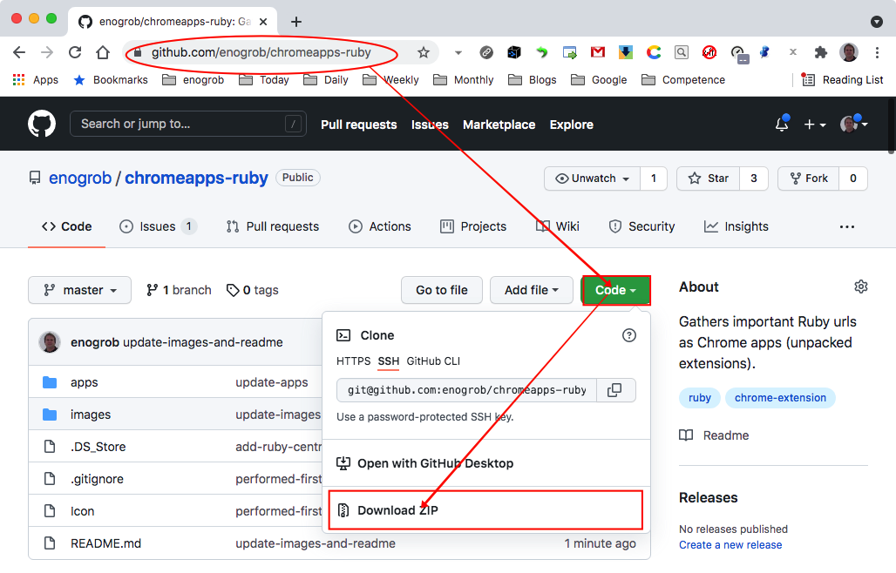
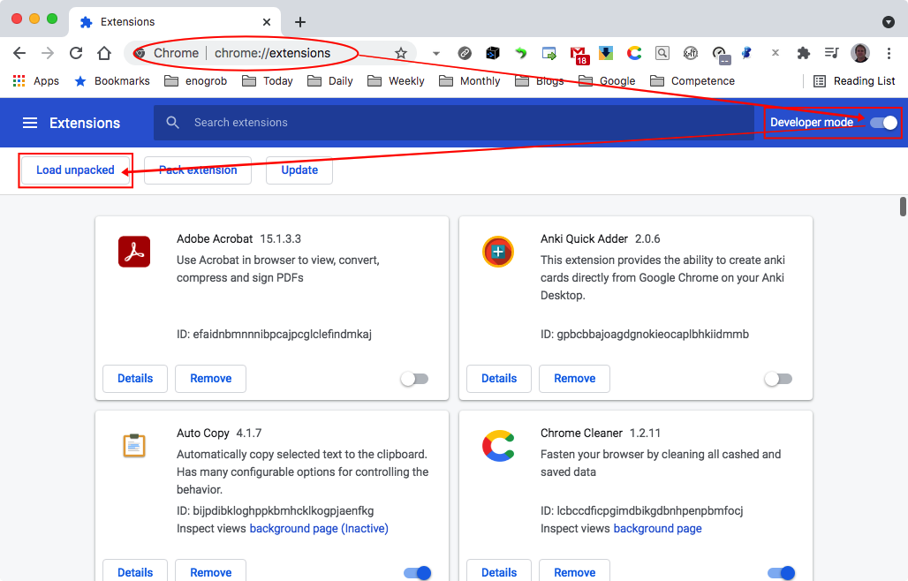
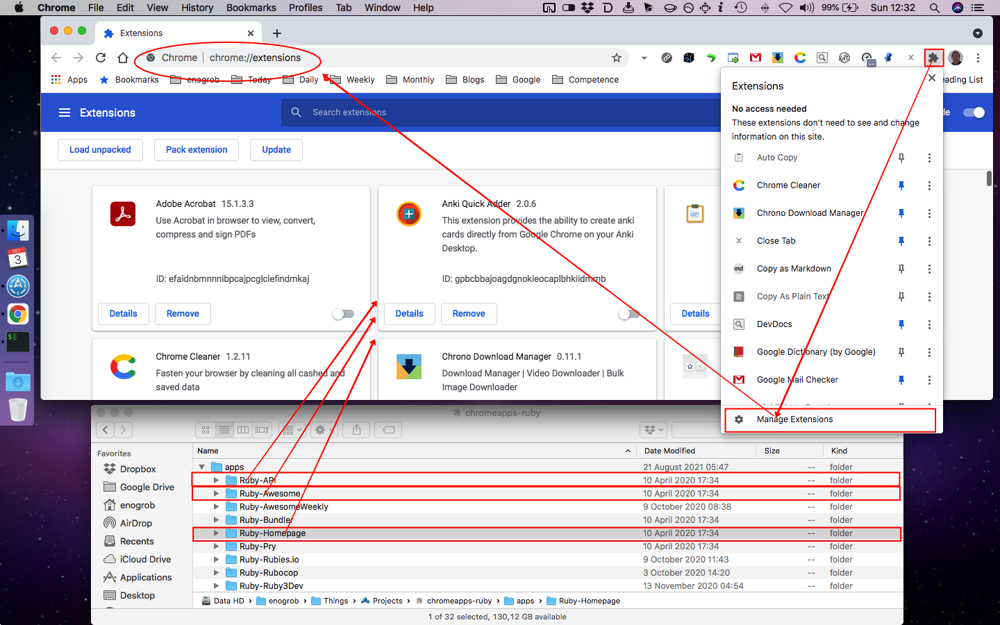
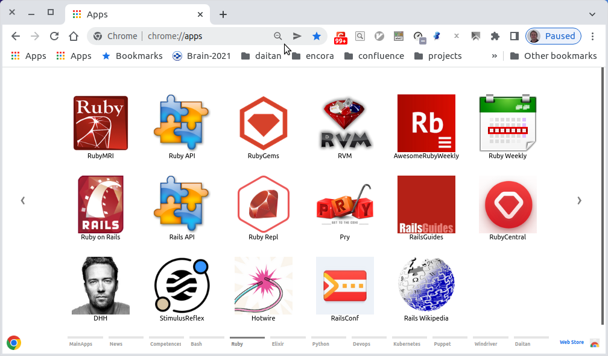

# Chrome Apps for Ruby

Gather Ruby important references and shortcuts in form of Chrome Apps.


## Installation

### 1. Clone this repository or download and see its contents.
Open a terminal give the following command:

```bash
$ git clone https://github.com/enogrob/chromeapps-ruby.git
$ cd chromeapps-ruby
```

As we can see a subdirectory is created for each Ruby app.

```bash
$ ls -la
total 984
drwxr-xr-x@   8 enogrob  staff    272 Oct  3 17:06 .
drwxr-xr-x@ 297 enogrob  staff  10098 Oct  3 17:06 ..
-rw-r--r--@   1 enogrob  staff   6148 Oct  3 16:58 .DS_Store
-rw-r--r--    1 enogrob  staff      5 May 31  2016 .gitignore
-rw-r--r--@   1 enogrob  staff      0 Nov 17  2016 Icon?
-rw-r--r--@   1 enogrob  staff   1886 Oct  3 17:11 README.md
drwxr-xr-x   19 enogrob  staff    646 Oct  3 17:08 apps
drwxr-xr-x    4 enogrob  staff    136 Oct  3 17:09 images

$ tree -L 1 apps/
apps
├── Ruby-API
├── Ruby-Awesome
├── Ruby-AwesomeWeekly
├── Ruby-Bundler
├── Ruby-Homepage
├── Ruby-Pry
├── Ruby-Rubies.io
├── Ruby-Rubocop
├── Ruby-Ruby3Dev
├── Ruby-RubyApi.org
├── Ruby-RubyCentral
├── Ruby-RubyConf
├── Ruby-RubyCritic
├── Ruby-RubyFLOW
├── Ruby-RubyForum
├── Ruby-RubyGems
├── Ruby-RubyLand
├── Ruby-RubyMine
├── Ruby-RubyOnJets
├── Ruby-RubyPacker
├── Ruby-RubyRepl
├── Ruby-RubyWeekly
├── Ruby-RubyWikipedia
├── Ruby-RVM
├── Ruby-StatusCodeWeekly
├── Ruby-Toolbox
├── Ruby-VsCode
├── Ruby-VsCodeAwesome
└── Ruby-WebCrunch

29 directories, 0 files

# in order to open Files in "Linux" to drag the App folders if wanted.
$ cd apps
$ xdg-open .&
```



### 2. Open Chrome with the following url:
In order to load the `Chrome Apps` for Ruby, check `Developer Mode` and press `Load unpacked extension...` to load each App selecting its corresponding directory inside `apps` e.g. `Ruby-Homepage`, and then repeat that for the wanted apps. 



Or just drag and drop the app folder on the [Extensions page](chrome://extensions).



### 3. After load the Chrome Apps wanted for Ruby, Chrome will look like the screenshot below:



Pressione the Chrome "Apps" button and then look for the ones you have inserted. You can drag as you want in order to put them in desired order.
