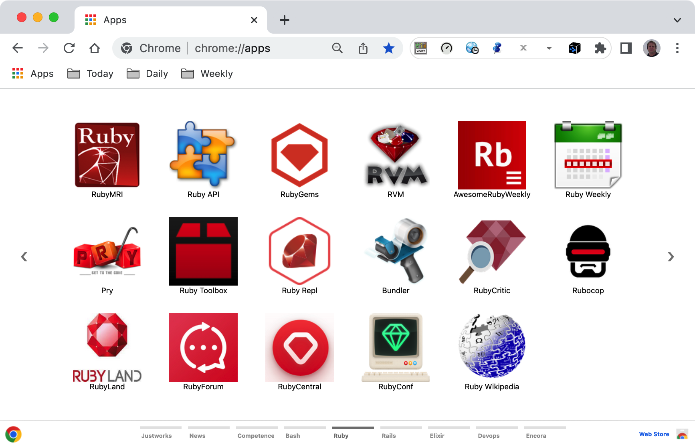

# Chrome Apps for Ruby

Gather Ruby important references and shortcuts in form of Chrome Apps.


## Installation

### 1. Clone this repository or download and see its contents.
Open a terminal give the following command:

```bash
$ git clone https://github.com/enogrob/chromeapps-ruby.git
$ cd chromeapps-ruby
```

As we can see a subdirectory is created for each Ruby app.

```bash
$ ls -la
total 44
drwxrwxr-x   7 rnogueira rnogueira 4096 mai 26 02:54  .
drwxrwxr-x 107 rnogueira rnogueira 4096 mai 22 20:33  ..
drwxrwxr-x  39 rnogueira rnogueira 4096 mai 26 02:54  apps
:
drwxrwxr-x   2 rnogueira rnogueira 4096 mai 26 02:48  images
-rw-rw-r--   1 rnogueira rnogueira 2358 mai 26 02:55  README.md
drwxrwxr-x   2 rnogueira rnogueira 4096 mai 26 02:45  resources

$ tree -L 1 apps/
apps
apps
├── Ruby-API
├── Ruby-Awesome
├── Ruby-AwesomeWeekly
├── Ruby-Bundler
├── Ruby-Homepage
├── Ruby-Pry
├── Ruby-RailsAPI
├── Ruby-RailsConf
├── Ruby-RailsDHH
├── Ruby-RailsHomepage
├── Ruby-RailsHotwire
├── Ruby-RailsRailsGuides
├── Ruby-RailsStimulusReflex
├── Ruby-RailsWikipedia
├── Ruby-Rubies.io
├── Ruby-Rubocop
├── Ruby-Ruby3Dev
├── Ruby-RubyApi.org
├── Ruby-RubyCentral
├── Ruby-RubyConf
├── Ruby-RubyCritic
├── Ruby-RubyFLOW
├── Ruby-RubyForum
├── Ruby-RubyGems
├── Ruby-RubyLand
├── Ruby-RubyMine
├── Ruby-RubyOnJets
├── Ruby-RubyPacker
├── Ruby-RubyRepl
├── Ruby-RubyWeekly
├── Ruby-RubyWikipedia
├── Ruby-RVM
├── Ruby-StatusCodeWeekly
├── Ruby-Toolbox
├── Ruby-VsCode
├── Ruby-VsCodeAwesome
└── Ruby-WebCrunch

37 directories, 0 files


# in order to open Files in "Linux" to drag the App folders if wanted.
$ cd apps
$ xdg-open .&
```


### 2. Open Chrome with the following url:
In order to load the `Chrome Apps` for Ruby, check `Developer Mode` and press `Load unpacked extension...` to load each App selecting its corresponding directory inside `apps` e.g. `Ruby-Homepage`, and then repeat that for the wanted apps. 


Or just drag and drop the app folder on the [Extensions page](chrome://extensions).


### 3. After load the Chrome Apps wanted for Ruby, Chrome will look like the screenshot below:



Pressione the Chrome "Apps" button and then look for the ones you have inserted. You can drag as you want in order to put them in desired order.
